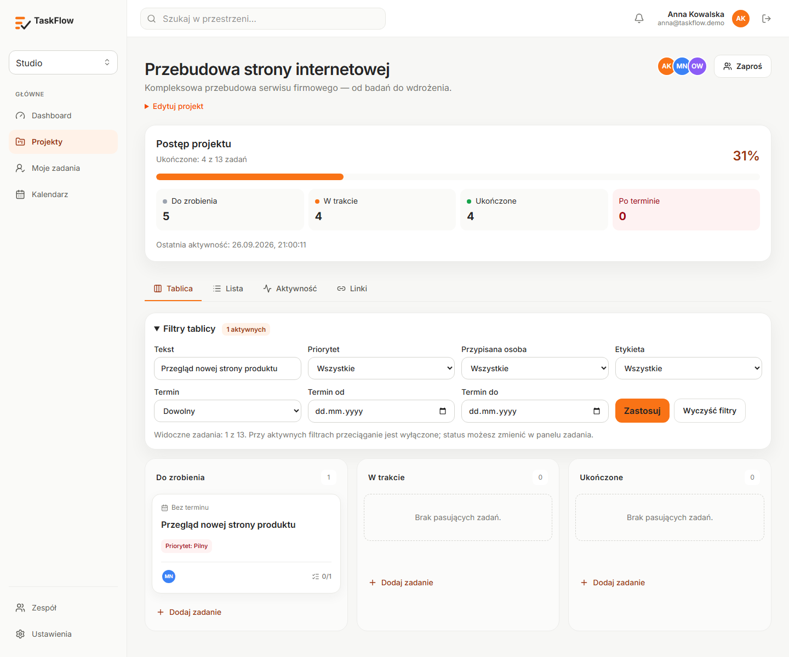

# TaskFlow v1.1

TaskFlow to polskojęzyczna aplikacja do prowadzenia projektów w małych zespołach. Łączy tablicę Kanban, szczegóły zadań, współpracę i statystyki w przestrzeniach roboczych z rolami.

**Publiczna aplikacja:** [taskflow-ochre-two.vercel.app](https://taskflow-ochre-two.vercel.app/) — rejestracja jest otwarta. Produkcyjna baza zaczyna się bez danych demonstracyjnych; znane konto z lokalnego seeda nie działa w publicznej aplikacji.



Zrzut tablicy pochodzi z działającej aplikacji na izolowanych danych testowych. Po publikacji na Vercel sfotografowano [stronę główną](./docs/screenshots/v1.1-stage4/landing-production.png), [rejestrację](./docs/screenshots/v1.1-stage4/register-production.png) i [powiadomienia podczas kontrolowanego testu](./docs/screenshots/v1.1-stage4/notifications-production.png). Pozostałe rzeczywiste widoki: [checklista](./docs/screenshots/v1.1-stage3/task-checklist.png), [statystyki projektu](./docs/screenshots/v1.1-stage3/project-metrics.png), [dashboard](./docs/screenshots/v1.1-stage3/dashboard-metrics.png) i [układ mobilny](./docs/screenshots/v1.1/kanban-mobile.png).

## Funkcje

- Przestrzenie robocze z rolami `OWNER`, `ADMIN`, `MEMBER`, zaproszeniami i izolacją danych.
- Projekty, archiwum, lista zadań oraz Kanban z trwałą kolejnością i sterowaniem klawiaturą.
- Zadania z priorytetem, terminem, przypisaniami, etykietami, komentarzami, linkami i historią zmian.
- Checklisty z edycją, ukończeniem, usuwaniem i wskaźnikiem postępu na karcie.
- Filtry Kanbanu zapisane w URL; przy aktywnych filtrach przeciąganie jest wyłączone, a status można edytować w panelu zadania.
- Powiadomienia w aplikacji o przypisaniach i komentarzach, licznik nieprzeczytanych oraz oznaczanie jako przeczytane.
- Dashboard i statystyki projektu liczone z rzeczywistych danych bieżącej przestrzeni, „Moje zadania”, kalendarz i wyszukiwanie.
- Responsywny interfejs, dostępna nawigacja, walidacja oraz autoryzacja operacji po stronie serwera.

## Technologia i architektura

Next.js 16 App Router, React 19, TypeScript, Tailwind CSS 4, PostgreSQL, Prisma 7 z `@prisma/adapter-pg`, NextAuth 4, Argon2id, Zod, React Hook Form, dnd-kit, Vitest, Testing Library i Playwright. To pojedyncza aplikacja full-stack.

Server Components pobierają dane, a Server Actions zapisują zmiany. Każda operacja sprawdza sesję i uprawnienia do przestrzeni po stronie serwera; identyfikator przestrzeni w URL nie jest źródłem uprawnień. Powiązane projekty, zadania, osoby i etykiety są weryfikowane w tej samej przestrzeni. Role ograniczają zarządzanie projektami i zespołem. Rate limiting działa atomowo w PostgreSQL, używa hashowanych kluczy i na Vercel także zaufanego adresu IP.

W produkcji Vercel uruchamia aplikację przez HTTPS, a Neon udostępnia osobną bazę PostgreSQL. Aplikacja używa połączenia pooled przez `DATABASE_URL`; Prisma CLI wykonuje migracje przez bezpośredni `DIRECT_URL`. Migracje są wersjonowane i uruchamiane świadomie przed wdrożeniem kodu wymagającego nowego schematu, nie przy każdym żądaniu.

## Uruchomienie lokalne

Potrzebne są Node.js 24, pnpm 12 i Docker Compose.

```bash
pnpm install
cp .env.example .env.local
docker compose up -d
pnpm prisma migrate dev
pnpm prisma db seed
pnpm dev
```

Otwórz `http://localhost:3000`. Lokalny PostgreSQL działa na porcie `5434`. Przed uruchomieniem ustaw własne długie wartości `NEXTAUTH_SECRET` i `RATE_LIMIT_SECRET` w ignorowanym przez Git `.env.local`. Lokalny seed tworzy dane przykładowe wyłącznie do developmentu; skrypt odmawia pracy przy `NODE_ENV=production`.

### Zmienne środowiskowe

| Zmienna                        | Przeznaczenie                                                                          |
| ------------------------------ | -------------------------------------------------------------------------------------- |
| `DATABASE_URL`                 | Połączenie aplikacji z PostgreSQL; na Neon adres pooled                                |
| `DIRECT_URL`                   | Bezpośrednie połączenie dla migracji Prisma; lokalnie opcjonalne, w produkcji wymagane |
| `NEXTAUTH_SECRET`              | Losowy sekret sesji                                                                    |
| `NEXTAUTH_URL`                 | Dokładny publiczny origin HTTPS; lokalnie `http://localhost:3000`                      |
| `RATE_LIMIT_SECRET`            | Osobny sekret HMAC dla kluczy limitowania                                              |
| `ENABLE_EXPERIMENTAL_COREPACK` | Na Vercel ustaw `1` dla pnpm 12 z `packageManager`                                     |

Sekrety i adresy bazy należą do ustawień środowiska, nie do repozytorium. `.env.example` zawiera tylko lokalne wartości przykładowe.

## Migracje i testy

Na nowej bazie zastosuj trzy migracje (`init`, checklista, powiadomienia) i sprawdź stan:

```bash
pnpm prisma migrate deploy
pnpm prisma migrate status
pnpm lint
pnpm typecheck
pnpm test
pnpm build
```

Playwright wymaga **oddzielnej** bazy testowej o nazwie `taskflow_e2e` lub `taskflow_e2e_*`. Po ustawieniu jej `DATABASE_URL`, migracjach i lokalnym seedzie uruchom `pnpm exec playwright test`. `e2e/global-setup.ts` odmawia pracy na bazie o innej nazwie. Nie uruchamiaj zestawu E2E ani seeda na Neon.

GitHub Actions sprawdza migracje na izolowanej bazie, lint, typy, testy, build i Playwright w Chromium przy pushu na `main` oraz w pull requestach. Vercel publikuje produkcję z `main`; przed zmianą schematu trzeba wykonać `prisma migrate deploy`. [Instrukcja wdrożenia Vercel + Neon](./docs/deployment/VERCEL_NEON_V1_1.md) opisuje kolejność i ustawienia.

## Uprawnienia

| Operacja                             | OWNER | ADMIN | MEMBER |
| ------------------------------------ | :---: | :---: | :----: |
| Odczyt projektów i zadań             |   ✓   |   ✓   |   ✓    |
| Tworzenie i edycja zadań             |   ✓   |   ✓   |   ✓    |
| Zarządzanie projektami               |   ✓   |   ✓   |   —    |
| Zaproszenia i usuwanie MEMBER        |   ✓   |   ✓   |   —    |
| Zmiana ról ADMIN i nazwy przestrzeni |   ✓   |   —   |   —    |

Zaproszenia są jednorazowe, ważne siedem dni; baza przechowuje ich hash SHA-256. Zarchiwizowany projekt jest tylko do odczytu. Linki w zadaniach akceptują jedynie HTTP/HTTPS i nie są pobierane przez serwer.

## Ograniczenia

Powiadomienia odświeżają się przy nawigacji lub odświeżeniu strony; aplikacja nie ma realtime, e-maili ani push. Nie ma odzyskiwania hasła, uploadu plików, samodzielnego usuwania konta lub przestrzeni, płatności, czatu ani trybu offline. Kolejna przestrzeń staje się dostępna przez zaproszenie. Publiczna wersja działa w limitach bezpłatnych planów usług.

Historia prac i wyniki jakości: [ROADMAP.md](./ROADMAP.md), [PROGRESS.md](./PROGRESS.md), [przegląd kodu](./docs/quality/REVIEW_V1_1.md), [przegląd UI](./docs/quality/UI_REVIEW_V1_1.md) oraz [definicje metryk](./docs/quality/STAGE3_METRICS.md). [Specyfikacja bazowa](./TASKFLOW_AGENT_SPEC.md) opisuje MVP; rozszerzenia v1.1 są w [roadmapie v1.1](./TASKFLOW_V1_1_ROADMAP.md).
