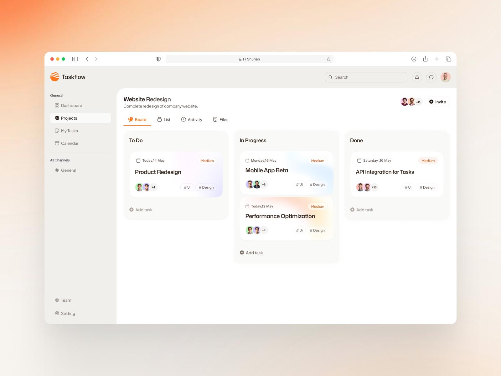

# TASKFLOW — kompletna specyfikacja projektu dla agenta AI w VS Code

**Wersja dokumentu:** 1.1  
**Język produktu:** polski  
**Typ projektu:** pełnostackowa, responsywna aplikacja webowa SaaS do zarządzania projektami i zadaniami  
**Cel:** stworzenie od zera działającego, estetycznego projektu do portfolio GitHub, a nie samego prototypu interfejsu.

**Status dokumentu:** poniższy opis zachowuje historyczny zakres i instrukcje budowy MVP. Dla istniejącego projektu TaskFlow v1.1 obowiązują nowszy `TASKFLOW_V1_1_ROADMAP.md` i zgody użytkownika na poszczególne etapy. W Etapie 3 do MVP dodano checklisty, filtry Kanbanu, powiadomienia wewnątrz aplikacji oraz rzeczywiste statystyki; zakazy dotyczące powiadomień push/e-mail i realtime nadal obowiązują. Nie tworzyć ponownie projektu ani repozytorium.

> **Instrukcja nadrzędna dla agenta:** potraktuj ten plik jako specyfikację implementacyjną. Samodzielnie zaprojektuj strukturę repozytorium, zaimplementuj aplikację, przygotuj bazę danych, testy, dokumentację i uruchom ją lokalnie. Nie kończ pracy po przygotowaniu makiety ani po pojedynczym etapie roadmapy: kontynuuj samodzielnie aż do spełnienia Definition of Done. Załóż nowe publiczne repozytorium GitHub `taskflow` na poprawnym koncie użytkownika i regularnie publikuj sprawdzone commity zgodnie z sekcją 15. Jeśli drobny szczegół nie został opisany, wybierz najprostsze spójne rozwiązanie i odnotuj decyzję w README. Nie rozszerzaj samowolnie zakresu o funkcje z sekcji „Poza MVP”.

## 1. Materiały i charakter wizualny

**Wzorzec graficzny:** `taskflow-ui-reference.png` znajdujący się obok niniejszego pliku. Otwórz obraz przed projektowaniem komponentów; to podstawowy punkt odniesienia dla całej aplikacji.



Odtwórz **język wizualny**, nie dosłownie fikcyjną zawartość obrazu. W szczególności:

- lekki, minimalistyczny dashboard typu SaaS: jasne, ciepłe biele i szarości, dużo wolnej przestrzeni;
- stały lewy panel nawigacyjny, subtelny górny pasek, duża powierzchnia robocza po prawej;
- zaokrąglone panele i karty, delikatne obramowania/cienie, brak ciężkich konturów;
- tablica Kanban z trzema jasnymi kolumnami i kartami z bardzo delikatnymi pastelowymi gradientami;
- mały, konsekwentny **pomarańczowy akcent** w logo, aktywnej zakładce, CTA oraz wybranych ikonach;
- wysoka czytelność, subtelne etykiety statusu/priorytetu, daty, avatary z inicjałami, tagi;
- proporcje desktopowe zbliżone do referencji: sidebar ok. 220–240 px, topbar ok. 64–72 px, kolumny Kanban o wygodnej szerokości, duże odstępy;
- typografia zbliżona do Inter; ikony w stylistyce Lucide; animacje krótkie i dyskretne.

**Sugerowane tokeny (można minimalnie skorygować po obejrzeniu obrazu):**

| Element | Kolor / parametr |
|---|---|
| Tło aplikacji | `#F7F7F5` |
| Główna powierzchnia | `#FFFFFF` |
| Sidebar / tło kolumn | `#FAFAF8` / `#FBFBFA` |
| Tekst główny | `#252525` |
| Tekst pomocniczy | `#848484` |
| Obramowania | `#ECECEA` |
| Akcent | `#F97316` |
| Akcent — delikatne tło | `#FFF2E8` |
| Promień panelu | 16–20 px |
| Promień karty | 14–18 px |

Karty mogą mieć łagodne tła/gradienty (lawenda, błękit, brzoskwinia), ale znaczenie statusu i priorytetu **nie może zależeć wyłącznie od koloru**. Zadbaj o dopracowane stany hover/focus/active, skeletony i stany puste. Nie kopiuj paska przeglądarki ani tła poza oknem przeglądarki ze zrzutu — są tylko oprawą prezentacyjną mockupu.

**Priorytet:** na desktopie ekran projektu powinien wizualnie od razu przypominać załączoną referencję. Pozostałe widoki mają korzystać z tego samego design systemu, a nie z przypadkowych wzorców UI. Interfejs całej aplikacji ma być po polsku (nazwę marki TaskFlow zachowaj).

## 2. Cel, użytkownicy i zakres produktu

TaskFlow umożliwia małym zespołom organizację projektów na tablicy Kanban. Użytkownik zakłada konto, tworzy własną przestrzeń roboczą, dodaje projekty i zadania, zaprasza współpracowników linkiem oraz śledzi postępy. To produkt wieloużytkownikowy: dane różnych przestrzeni muszą być całkowicie izolowane.

**MVP obejmuje:**

1. Rejestrację, logowanie i wylogowanie.
2. Przestrzenie robocze z przełączaniem aktywnej przestrzeni oraz rolami członków.
3. Projekty, tablicę Kanban, widok listy, widok aktywności i widok załączonych linków.
4. Zadania, terminy, priorytety, przypisywanie członków, etykiety, komentarze i historię zmian.
5. Przeciąganie i zmianę kolejności kart z trwałym zapisem w bazie.
6. Dashboard, „Moje zadania”, kalendarz terminów i wyszukiwanie.
7. Zapraszanie współpracowników bez konieczności integracji z usługą e-mail.
8. Podstawowy panel zespołu/ustawień, obsługę błędów, responsywność, testy i dokumentację.

**Poza MVP — nie implementuj:** czat i kanały, powiadomienia push/e-mail, płatności i subskrypcje, upload plików do storage, funkcje AI, integracje z GitHub/Slack/Google Calendar, pełny tryb offline, rozbudowane raporty, wersjonowanie dokumentów, powiadomienia czasu rzeczywistego. Ikon lub zakładek sugerujących te funkcje nie zostawiaj jako niedziałających dekoracji. W szczególności sekcja „All Channels” widoczna na inspiracji **nie wchodzi do MVP**.

## 3. Architektura i technologie

Zbuduj **jeden monolit full-stack**, bez osobnego mikroserwisu API.

- Next.js (App Router), React, TypeScript w trybie strict.
- Tailwind CSS i shadcn/ui (komponenty lokalnie kontrolowane przez projekt), Lucide Icons, font Inter.
- PostgreSQL i Prisma ORM; wersje stabilne, wzajemnie kompatybilne w momencie implementacji, bez beta/RC.
- Auth.js z logowaniem email + hasło (Credentials), bez logowania społecznościowego. Hasła haszuj bezpiecznym algorytmem, np. Argon2id; sesje obsługuj zgodnie z wymogami wybranej stabilnej wersji Auth.js. Nie twórz własnej kryptografii ani własnego formatu sesji.
- Zod do walidacji wejścia, React Hook Form tam, gdzie formularze stają się rozbudowane.
- `@dnd-kit` do przeciągania kart; `date-fns` z polską lokalizacją do dat.
- Server Components do pobierania danych, Server Actions **lub** Route Handlers do mutacji (wybierz spójny model); cała walidacja uprawnień musi odbywać się po stronie serwera. Przy przeciąganiu zastosuj lokalną aktualizację optymistyczną z cofnięciem po błędzie.
- Vitest + React Testing Library do logiki i komponentów, Playwright do testów E2E.
- pnpm jako menedżer pakietów, ESLint, Prettier, Docker Compose dla lokalnej bazy, GitHub Actions do CI.

Nie dodawaj Redux, kolejek, WebSocketów, osobnego backendu Express, Redis ani usług chmurowych, jeśli nie są naprawdę potrzebne do opisanego MVP. Konfiguracja przez zmienne środowiskowe; żadnych sekretów w repozytorium.

## 4. Model uprawnień i wielodostępności

### 4.1 Zasady przestrzeni roboczych

- Po rejestracji użytkownik otrzymuje własną przestrzeń domyślną i rolę `OWNER`.
- Użytkownik może należeć do kilku przestrzeni i przełączać je selektorem w sidebarze. Aktywną przestrzeń trzymaj w adresie URL, np. `/w/[workspaceId]/...`; nie ufaj samemu ID z klienta.
- Każda przestrzeń posiada własne projekty, zadania, członków i zaproszenia. Dane przestrzeni nie mieszają się w dashboardzie, wyszukiwaniu ani kalendarzu.
- Role członków: `OWNER`, `ADMIN`, `MEMBER`.
- `OWNER`: pełna administracja przestrzenią i rolami; nie może zostać usunięty ani opuścić przestrzeni w MVP.
- `ADMIN`: edycja przestrzeni, projekty, zaproszenia, zarządzanie członkami poza właścicielem.
- `MEMBER`: odczyt wszystkich projektów w swojej przestrzeni; tworzenie i edycja zadań, komentarzy, linków i przypisań; bez zarządzania członkami i ustawieniami przestrzeni.
- W MVP wszyscy członkowie przestrzeni widzą wszystkie jej projekty. Nie wprowadzaj osobnych uprawnień per projekt.

| Operacja | OWNER | ADMIN | MEMBER |
|---|:---:|:---:|:---:|
| Widok projektów/zadań | Tak | Tak | Tak |
| Tworzenie/edycja/przenoszenie zadań | Tak | Tak | Tak |
| Komentarze i linki | Tak | Tak | Tak |
| Tworzenie/edycja/archiwizacja projektu | Tak | Tak | Nie |
| Zaproszenia i zarządzanie członkami | Tak | Tak* | Nie |
| Zmiana ról administratorów / nazwy przestrzeni | Tak | Nie | Nie |

\* Admin nie może zmienić ani usunąć właściciela oraz nie może nadawać roli OWNER.

### 4.2 Bezpieczeństwo operacji

Dla **każdego** odczytu i mutacji sprawdzaj sesję, członkostwo w przestrzeni i wymaganą rolę. Sprawdzaj, że projekt, zadanie, etykieta i osoba przypisywana do zadania należą do aktywnej przestrzeni. Nie przyjmuj `workspaceId`, `userId` ani roli z klienta jako dowodu autoryzacji. Testuj przypadki manipulacji ID w URL/formularzach.

## 5. Struktura danych

Zaprojektuj migracje Prisma z indeksami, kluczami obcymi i ograniczeniami unikalności. Nazwy techniczne możesz dopasować do konwencji projektu, ale relacje i reguły zachowaj.

| Encja | Kluczowe pola i relacje |
|---|---|
| `User` | id, name, email (unikalne, normalizowane), passwordHash, avatarColor/initials lub opcjonalny avatarUrl, createdAt |
| `Workspace` | id, name, slug lub id w routingu, ownerId, createdAt, updatedAt |
| `WorkspaceMember` | workspaceId, userId, role, joinedAt; unikalne `(workspaceId, userId)` |
| `WorkspaceInvite` | id, workspaceId, tokenHash (unikalne), createdById, expiresAt, acceptedAt, acceptedById; token wyłącznie w linku i tylko hash w DB |
| `Project` | id, workspaceId, name, description?, archivedAt?, createdById, createdAt, updatedAt |
| `Task` | id, projectId, title, description?, status (`TODO`, `IN_PROGRESS`, `DONE`), position (liczba całkowita), priority (`LOW`, `MEDIUM`, `HIGH`, `URGENT`), dueDate?, createdById, createdAt, updatedAt |
| `TaskAssignee` | taskId, userId; unikalne `(taskId, userId)` |
| `Label` | id, workspaceId, name, color; unikalność nazwy w obrębie przestrzeni |
| `TaskLabel` | taskId, labelId; unikalne `(taskId, labelId)` |
| `Comment` | id, taskId, authorId, body, createdAt, updatedAt |
| `TaskLink` | id, taskId, title, url, createdById, createdAt |
| `Activity` | id, workspaceId, projectId?, taskId?, actorId, action, metadataJson (niesekretne dane), createdAt |

`Task` przynależy do przestrzeni poprzez projekt; dodatkowego `workspaceId` w zadaniu nie wymagaj, jeśli dostęp sprawdzasz bezpiecznie poprzez relację. `position` określa porządek w danej kolumnie danego projektu. Zaprojektuj indeksy pod filtrowanie zadań po projekcie/statusie/pozycji, terminach i przypisaniu. Jeśli Auth.js wymaga dodatkowych tabel, dodaj je zgodnie z wybraną konfiguracją.

Aktywność zapisuj dla istotnych zmian: utworzenie zadania, zmiana statusu, tytułu/terminu/priorytetu, przypisania, komentarz, dodanie/usunięcie linku i archiwizacja projektu. Nie zapisuj sekretów ani pełnych danych sesyjnych w `metadataJson`.

## 6. Główne widoki i przepływy

### 6.1 Publiczne i logowanie

- `/` — prosta, estetyczna strona startowa z opisem aplikacji i przyciskami „Zaloguj się” / „Utwórz konto”; dla zalogowanego użytkownika przekierowanie do aktywnej przestrzeni.
- `/login` — e-mail, hasło, walidacja i czytelny komunikat bez zdradzania, czy konto istnieje.
- `/register` — imię, e-mail, hasło i powtórzenie; utworzenie użytkownika oraz przestrzeni w jednej bezpiecznej operacji; po sukcesie wejście do aplikacji.
- Brak odzyskiwania hasła e-mailem w MVP; nie umieszczaj niedziałającego „Zapomniałeś hasła?”.

### 6.2 Wspólny layout po zalogowaniu

- Sidebar: brand TaskFlow z prostą autorską ikoną, selektor przestrzeni, **Dashboard**, **Projekty**, **Moje zadania**, **Kalendarz**, na dole **Zespół**, **Ustawienia**.
- Topbar: funkcjonalne pole globalnego wyszukiwania (projekty i zadania w aktywnej przestrzeni), menu profilu z imieniem i wylogowaniem. Nie pokazuj ikony powiadomień ani czatu, jeśli nie ma za nią funkcji.
- Aktywna nawigacja subtelnie wyróżniona; ikony Lucide; układ spójny ze zrzutem.
- Desktop: sidebar stale widoczny. Tablet/mobile: sidebar jako wysuwane menu uruchamiane przyciskiem; klawiaturowo dostępny.

### 6.3 Dashboard `/w/[workspaceId]/dashboard`

Powitanie, przycisk „Nowy projekt”, kafle z rzeczywistymi danymi (liczba aktywnych projektów, moich otwartych zadań, zadań po terminie, zadań ukończonych), lista ostatnich projektów i najbliższych terminów. Bez sztucznych wykresów lub fikcyjnych danych. Pusty stan prowadzi do utworzenia pierwszego projektu.

### 6.4 Projekty `/w/[workspaceId]/projects`

Lista/karty projektów z nazwą, opisem, liczbą zadań i postępem. Właściciel/admin może utworzyć projekt, edytować nazwę/opis i zarchiwizować po potwierdzeniu; archiwum jest widoczne w odrębnej sekcji z opcją przywrócenia. Członek może przeglądać. Po stworzeniu projektu przejdź na tablicę z trzema statusami. Projekt zarchiwizowany jest tylko do odczytu do czasu przywrócenia.

### 6.5 Projekt — podstawowy widok `/w/[workspaceId]/projects/[projectId]`

To **najważniejszy ekran** i główny odpowiednik referencji. Nagłówek: tytuł projektu, krótki opis, avatary członków przestrzeni (maks. kilka + licznik), funkcjonalny przycisk **Zaproś** dla OWNER/ADMIN. Pod nim zakładki:

- **Tablica:** 3 kolumny „Do zrobienia”, „W trakcie”, „Ukończone”. Każda pokazuje liczbę zadań i przycisk „Dodaj zadanie”. Karta prezentuje termin, tytuł, priorytet, avatary przypisanych i maks. kilka etykiet. Kliknięcie otwiera szczegóły.
- **Lista:** te same zadania, czytelna tabela/lista z filtrem statusu, priorytetu, przypisanego i wyszukiwaniem po tytule; kliknięcie otwiera szczegóły. Zmiany widoczne w obu widokach.
- **Aktywność:** chronologiczny feed zdarzeń projektu, najnowsze na górze, autor/czas/krótki opis.
- **Linki:** lista odnośników dołączonych do zadań w projekcie; nazwa, zadanie, autor, data, bezpieczne otwieranie w nowej karcie. To wizualny odpowiednik zakładki „Files” ze zrzutu, ale **bez uploadu plików**. Nazwij ją „Linki”, aby nie obiecywać funkcji uploadu.

Tablica: drag-and-drop między kolumnami i w ramach kolumny; po upuszczeniu zapis statusu i pozycji w transakcji. Zadbaj o uchwyty, dostępność klawiaturową i alternatywną zmianę statusu w szczegółach zadania. Przy błędzie zapisu pokaż komunikat i odtwórz poprzedni porządek. Kolumny nie mogą mieć fikcyjnie działających elementów.

### 6.6 Zadanie — modal lub panel boczny

Pola: tytuł (wymagany), opis (zwykły tekst z zachowaniem nowych linii, bez niebezpiecznego HTML), status, priorytet, termin, przypisani członkowie przestrzeni, etykiety, komentarze, linki URL. Zawiera historię ostatnich zmian zadania. Umożliwia edycję i usunięcie zadania po potwierdzeniu. Wszyscy członkowie przestrzeni mogą edytować zadania; usunięcie ogranicz do twórcy zadania albo OWNER/ADMIN. W formularzach pokaż błędy walidacji, stany zapisu i sukcesu.

### 6.7 „Moje zadania” `/w/[workspaceId]/my-tasks`

Zadania przypisane zalogowanemu użytkownikowi z aktywnych projektów danej przestrzeni; grupowanie/filtrowanie po statusie oraz terminie, link do projektu i szczegółów. Jasny pusty stan.

### 6.8 Kalendarz `/w/[workspaceId]/calendar`

Prosty miesięczny widok terminów zadań z aktualnej przestrzeni, nawigacją między miesiącami i listą pozycji po wyborze dnia. Zadania bez terminu nie pojawiają się w kalendarzu. Nie implementuj synchronizacji z zewnętrznym kalendarzem.

### 6.9 Zespół `/w/[workspaceId]/team`

Lista członków z avatarami/inicjałami, nazwą, e-mailem i rolą. OWNER/ADMIN może wygenerować **jednorazowy link zaproszenia** ważny 7 dni, skopiować go i unieważnić przed użyciem. Zapraszana osoba loguje się lub rejestruje, widzi nazwę przestrzeni i jawnie akceptuje. Po zaakceptowaniu dołącza jako `MEMBER`. Nie wysyłaj e-maili. Po wykorzystaniu/wygaśnięciu token jest nieważny. Nie wyświetlaj jawnego tokenu po zamknięciu modala generowania. OWNER może zmienić MEMBER ↔ ADMIN; OWNER/ADMIN może usunąć MEMBER, a OWNER również ADMIN; nikt nie usuwa OWNER. Potwierdzaj działania destrukcyjne.

### 6.10 Ustawienia `/w/[workspaceId]/settings`

Dane użytkownika: edycja imienia i podgląd e-maila; menu wylogowania. OWNER może zmieniać nazwę przestrzeni. Pozostali widzą nazwę tylko do odczytu. Nie dodawaj rozbudowanej konfiguracji firmy ani ustawień bez efektu.

### 6.11 Wyszukiwanie

Wpisywanie w topbarze otwiera wyniki projektów i zadań tylko z aktywnej przestrzeni, z obsługą stanu ładowania/braku wyników. Ogranicz liczbę wyników, dodaj debounce, bezpieczne przekierowanie do konkretnego projektu/zadania. Wyszukiwanie musi sprawdzać sesję oraz membership na serwerze.

## 7. Reguły domenowe i walidacja

- Nazwy: trim i rozsądne limity długości; np. nazwa przestrzeni/projektu 2–80 znaków, tytuł zadania 1–160, komentarz 1–2000, opis do 10 000. Wspólne schematy Zod po stronie serwera.
- E-maile normalizuj; nie pozwalaj na duplikaty kont.
- Hasło min. 10 znaków; nigdy nie zapisuj i nie loguj hasła w postaci jawnej.
- Termin zadania zapisuj w przewidywalny sposób; prezentuj daty w polskim formacie i ustalonej strefie klienta, bez przypadkowego przesunięcia dnia przy wyborze daty. Jeśli termin jest datą bez godziny, modeluj go konsekwentnie jako datę kalendarzową.
- Priorytety: niski/średni/wysoki/pilny. Domyślny: średni. Status początkowy: do zrobienia.
- Nowo utworzone zadanie trafia na koniec właściwej kolumny; porządek nie może pozostawać jedynie w stanie przeglądarki.
- Przenoszenie zadania może zmienić status i pozycję, ale nie może przenieść go między projektami. Zapisuj zmiany atomowo.
- Przydzielać zadania można wyłącznie członkom danej przestrzeni.
- Etykiety należą do przestrzeni, link URL musi mieć `http://` lub `https://`. W zewnętrznych odnośnikach używaj `rel="noopener noreferrer"`; backend nie pobiera tych URL (ochrona m.in. przed SSRF).
- Nazwy i teksty użytkowników wyświetlaj jako tekst, bez renderowania surowego HTML; nie loguj tokenów zaproszeń ani sekretów.
- Operacje modyfikujące dane waliduj także na serwerze, nawet jeśli formularz ma walidację klienta.

## 8. Wymagania bezpieczeństwa

1. Bezpieczne zarządzanie sesją zgodne z Auth.js, ciasteczka i CSRF zgodnie z używanym mechanizmem, kontrola dostępu zarówno dla stron, jak i mutacji.
2. Izolacja tenantów: odczyt/mutacja cudzego `workspaceId`, `projectId`, `taskId`, `commentId` i `inviteId` ma być niemożliwa; odpowiedzi nie powinny ujawniać nieautoryzowanych danych.
3. Tokeny zaproszeń: generuj kryptograficznie losowy token, w bazie zapisuj tylko hash, jednorazowość i wygaśnięcie sprawdzaj atomowo w transakcji. Weryfikuj stan zaproszenia przy akceptacji i dopiero potem twórz membership.
4. Ochrona przed nadużyciami podstawowych endpointów rejestracji/logowania/zaproszeń (np. prosty rate limit zależny od warunków deployu); nie opieraj bezpieczeństwa tylko na ukryciu przycisków.
5. Zadbaj o bezpieczne nagłówki i konfigurację produkcyjną, sekrety w `.env.local`, przykład w `.env.example`.
6. Nigdy nie dodawaj do repozytorium prawdziwych kluczy, prawdziwych kont lub produkcyjnej bazy. Logi nie mogą ujawniać haseł i tokenów.

## 9. UX, RWD i dostępność

- Mobile (od ok. 360 px): sidebar wysuwany; tablica przewijana poziomo z kolumnami o zachowanej użytecznej szerokości, zamiast trzech ściśniętych kolumn. Modal zadania może zmienić się w pełnoekranowy panel.
- Tablet: adaptacyjna siatka. Desktop: układ zbliżony do zdjęcia referencyjnego, bez rozciągania kart na pełną szerokość ekranu.
- Formularze z etykietami, opisami błędów, poprawnym focusem, stanem disabled podczas zapisu.
- Dialogi zamykane Escape, zarządzanie focusem, odpowiednia kontrastowość, czytelne komunikaty toast.
- Alternatywa dla drag-and-drop: zmiana statusu i pozycji także przy użyciu klawiatury lub kontrolki w szczegółach zadania.
- Puste stany powinny proponować następną czynność; skeletony nie mogą powodować dużych skoków layoutu.
- Nie twórz przycisków z `href="#"` ani atrap funkcji. Jeśli działanie nie należy do MVP, usuń je z UI.

## 10. Sugerowana organizacja repozytorium

Dokładne nazwy mogą być dostosowane do wersji Next.js/Prisma:

```text
taskflow/
├─ app/
│  ├─ (public)/
│  ├─ (auth)/login/ i register/
│  ├─ w/[workspaceId]/
│  │  ├─ dashboard/
│  │  ├─ projects/ i projects/[projectId]/
│  │  ├─ my-tasks/
│  │  ├─ calendar/
│  │  ├─ team/
│  │  └─ settings/
│  └─ api/ (tylko gdy potrzebne)
├─ components/
│  ├─ ui/
│  ├─ layout/
│  ├─ projects/
│  ├─ tasks/
│  └─ shared/
├─ lib/
│  ├─ auth/
│  ├─ db/
│  ├─ permissions/
│  ├─ validations/
│  └─ services/
├─ prisma/
│  ├─ schema.prisma
│  ├─ migrations/
│  └─ seed.ts
├─ tests/
├─ e2e/
├─ public/
├─ .github/workflows/
├─ .env.example
├─ docker-compose.yml
└─ README.md
```

Oddzielaj logikę domenową i autoryzację od komponentów wizualnych. Nie duplikuj ręcznie sprawdzania ról w dziesięciu miejscach; stosuj sprawdzone funkcje typu `requireSession`, `requireWorkspaceMember`, `requireWorkspaceRole`, `requireProjectAccess`. Nie komplikuj jednak projektu wielowarstwową architekturą dla samej architektury.

## 11. Seed i dane demonstracyjne

Przygotuj bezpieczny, **jawnie demonstracyjny** seed do lokalnego środowiska. Co najmniej 1 użytkownik demo, przestrzeń „Studio”, projekt „Przebudowa strony internetowej”, kilkanaście zadań rozmieszczonych w trzech statusach, różne priorytety/terminy, etykiety i kilka komentarzy/aktywności. Dodaj również 1–2 przykładowych członków, jeśli seed wspiera ich logowanie. Kolumny i karty powinny dawać efekt podobny do referencji, ale wszystko ma pochodzić z bazy, nie z zakodowanej w JSX makiety. Dane i dane logowania demo opisz w README; seed uruchamiaj **tylko świadomie w środowisku deweloperskim**, nigdy automatycznie na produkcji.

## 12. Testy i kryteria akceptacji

### 12.1 Testy jednostkowe / integracyjne

Sprawdź co najmniej: walidację, uprawnienia ról, filtrowanie danych aktywnej przestrzeni, reguły zaproszenia (wygasłe, użyte, ponowna akceptacja), dozwolone przypisania, porządkowanie zadań i ich zmianę statusu. Testuj logikę serwerową z bazą testową tam, gdzie mocki mogłyby ukryć błąd kontroli dostępu.

### 12.2 Scenariusze E2E

1. Rejestracja → automatycznie powstała przestrzeń → nowy projekt → nowe zadanie.
2. Logowanie i wylogowanie.
3. Zmiana statusu zadania przez drag-and-drop → odświeżenie → stan nadal zapisany.
4. Edycja zadania, przypisanie członka, dodanie komentarza i linku → widoczność w szczegółach i aktywności.
5. Link zaproszenia → zalogowanie/utworzenie konta → dołączenie → odmowa powtórnego użycia.
6. MEMBER nie może wejść do akcji zastrzeżonych dla OWNER/ADMIN nawet przez bezpośredni adres lub wywołanie mutacji.
7. Użytkownik z obcej przestrzeni nie widzi i nie modyfikuje projektów/zadań po podmianie identyfikatorów.
8. Wyszukiwanie, „Moje zadania”, kalendarz i widoki projektu pokazują spójne, rzeczywiste dane.
9. Mobile: działa menu i nawigacja, tablica jest używalna, modal nie wychodzi poza ekran.

### 12.3 Definition of Done

Projekt uznaj za gotowy **dopiero gdy**:

- aplikacja startuje lokalnie z instrukcji README na czystym środowisku;
- migracje i seed działają, a nowe dane są trwale zapisywane;
- wszystkie wymienione widoki i działania MVP działają; nie ma martwych przycisków;
- ekran tablicy oddaje charakter referencji, a layout pozostaje spójny i responsywny;
- testy, typecheck, lint i build przechodzą;
- autoryzacja jest weryfikowana po stronie serwera i istnieją testy izolacji przestrzeni;
- brak prawdziwych sekretów i przypadkowo commitowanych plików `.env`;
- README zawiera funkcje, stack, uruchomienie, env, migracje, seed, testy, screenshoty i znane ograniczenia.
- `ROADMAP.md` odzwierciedla rzeczywisty stan ukończenia etapów oraz ich kryteriów odbioru.
- Na **właściwym koncie** istnieje nowe publiczne repozytorium `taskflow` z kompletnym kodem, poprawnym autorem commitów i aktualnym branchem domyślnym; zweryfikowano adres remote i synchronizację z GitHubem. Jeżeli użytkownik musi odblokować logowanie/uprawnienia lub istnieje konflikt nazwy, zgłoś to jako jawną blokadę publikacji, nie udawaj sukcesu.

Nie raportuj testów jako zaliczonych, jeśli nie zostały uruchomione. Jeżeli ograniczenia środowiska blokują weryfikację, opisz konkretnie, co nie zostało sprawdzone i dlaczego.

## 13. Lokalne uruchamianie i wdrożenie

W repozytorium przygotuj skrypty umożliwiające co najmniej:

```bash
pnpm install
cp .env.example .env.local
docker compose up -d
pnpm prisma migrate dev
pnpm prisma db seed
pnpm dev

pnpm lint
pnpm typecheck
pnpm test
pnpm build
pnpm exec playwright test
```

Jeżeli z powodu wybranej wersji narzędzi składnia różni się od powyższej, popraw skrypty i README. `.env.example` musi jawnie opisywać wymagane zmienne (np. `DATABASE_URL`, sekret Auth.js i adres aplikacji), bez prawdziwych wartości. Przygotuj workflow CI dla install → lint → typecheck → test → build. Testy wymagające bazy uruchamiaj na izolowanej testowej instancji PostgreSQL. W README podaj praktyczną ścieżkę wdrożenia Next.js i hostowanego PostgreSQL, lecz nie musisz tworzyć kont ani wdrażać aplikacji za użytkownika.

## 14. Szczegółowa roadmapa implementacji i zasady autonomicznej realizacji

**Zasada wykonawcza:** to plan *do zrealizowania*, a nie ogólna sugestia. Przechodź przez etapy po kolei, kończąc każdy jego kryteriami odbioru. Po ukończeniu etapu aktualizuj `ROADMAP.md`, wykonuj testy adekwatne do wykonanej zmiany, a następnie twórz logiczny commit i `git push` według sekcji 15. Nie oczekuj potwierdzenia użytkownika między etapami. Kontynuuj aż do spełnienia sekcji 12.3, chyba że napotkasz rzeczywistą blokadę zewnętrzną (np. brak autoryzacji do GitHub, brak danych konfiguracyjnych, których nie wolno zgadywać, lub brak niezbędnej usługi). Gdy blokada dotyczy wyłącznie GitHuba, kontynuuj implementację i commity lokalnie, a publikację odłóż i jednoznacznie zgłoś.

W pierwszym etapie utwórz w projekcie `ROADMAP.md`, zawierający poniższe fazy jako checklistę (`[ ]` / `[x]`), krótkie kryteria odbioru, stan testów i odnośniki do odpowiednich commitów. Oznaczaj etap jako zakończony **dopiero po sprawdzeniu** kryteriów. Nie utożsamiaj samego istnienia kodu z działającą funkcją. W razie awarii napraw błąd przed przejściem do zależnego etapu. Nie rozbudowuj zakresu ponad MVP, aby „domknąć” roadmapę.

### Etap 0 — analiza projektu i bezpieczny preflight

**Prace:**
- Sprawdź katalog roboczy, `git status`, aktualny branch, istniejące pliki i historię; nie nadpisuj nieswoich zmian i nie usuwaj plików użytkownika.
- Przeczytaj cały dokument i obejrzyj `taskflow-ui-reference.png`; wypisz spójne założenia oraz kolejność prac w `ROADMAP.md`.
- Sprawdź dostępność Node.js, pnpm, Dockera, PostgreSQL/Docker Compose, Git, GitHub CLI i możliwość uruchomienia testów przeglądarkowych. Ustal kompatybilne stabilne wersje pakietów.
- Przeprowadź kontrolę konta GitHub i danych autora commita według sekcji 15 **przed pierwszym commitem lub utworzeniem zdalnego repozytorium**.

**Kryteria odbioru:** znany stan wyjściowy; referencja obejrzana; roadmapa zapisana; nieusunięte dotychczasowe pliki; potwierdzona tożsamość autora i właściwe konto lub jasno opisana blokada.

### Etap 1 — szkielet, design system i repozytorium GitHub

**Prace:**
- Utwórz aplikację Next.js App Router + TypeScript strict, skonfiguruj pnpm, Tailwind, shadcn/ui, Inter, ikony, lint, formatowanie, aliasy oraz sensowny `.gitignore`.
- Dodaj Docker Compose dla PostgreSQL, `.env.example`, bazowy layout, tokeny wizualne i wstępne strony publiczne/logowania; przygotuj komponenty wspólne.
- Zachowaj referencję graficzną w repozytorium (np. `docs/reference/taskflow-ui-reference.png`) i przygotuj miejsce na screenshoty **rzeczywistego** UI.
- Utwórz nowe **publiczne** repo `taskflow` na zweryfikowanym koncie, połącz `origin`, zrób pierwszy poprawnie podpisany commit i wyślij go, zgodnie z sekcją 15. Nie używaj cudzej/losowej nazwy autora.

**Kryteria odbioru:** `pnpm install`, podstawowe `lint`, `typecheck` i `build` przechodzą; strona startowa działa; zdalne repo ma pierwszy commit (albo jawnie udokumentowana jest blokada samej publikacji).

### Etap 2 — baza danych, logowanie i izolacja przestrzeni

**Prace:**
- Przygotuj model Prisma z relacjami/indeksami z sekcji 5, migrację inicjalną oraz bezpieczne połączenie z bazą.
- Zaimplementuj rejestrację, haszowanie haseł, logowanie, sesje, wylogowanie i tworzenie domyślnej przestrzeni w transakcji.
- Dodaj centralne funkcje autoryzacji i sprawdzania `workspaceId`/ról na serwerze; routing aktywnej przestrzeni.
- Dodaj testy walidacji i odmowy dostępu do obcych przestrzeni.

**Kryteria odbioru:** nowy użytkownik może założyć konto, zalogować się i wylogować; baza i migracje działają; użytkownik nie odczytuje obcej przestrzeni; testy etapu przechodzą.

### Etap 3 — dopracowany layout i zarządzanie projektami

**Prace:**
- Zbuduj responsywny sidebar, topbar, selektor przestrzeni, nawigację i podstawowe stany empty/loading/error zgodnie ze zdjęciem.
- Zaimplementuj listę projektów, utworzenie, edycję, archiwizację i przywracanie z odpowiednimi uprawnieniami.
- Zbuduj ekran szczegółów projektu: nagłówek, zakładki i trzy kolumny; wszystkie dane pobieraj z DB, nie koduj fikcyjnych kart.

**Kryteria odbioru:** projekt można utworzyć i znaleźć po odświeżeniu; MEMBER nie może zarządzać projektami; desktopowy ekran projektu jest wizualnie spójny z referencją; mobile ma używalną nawigację.

### Etap 4 — zadania, Kanban, trwała kolejność i widok listy

**Prace:**
- Zaimplementuj CRUD zadań, szczegóły, status, priorytet, terminy, edycję/usunięcie z potwierdzeniem, walidację i autoryzację.
- Dodaj `@dnd-kit`: przenoszenie między kolumnami, porządkowanie wewnątrz kolumny, zapis transakcyjny oraz rollback UI przy błędzie.
- Zaimplementuj widok listy z filtrami, zsynchronizowany z tablicą; dodaj alternatywę klawiaturową lub kontrolki do zmiany statusu.
- Zapisuj podstawową historię zmian.

**Kryteria odbioru:** po przesunięciu zadania i odświeżeniu status/kolejność pozostają poprawne; list/board pokazują te same dane; błąd zapisu nie pozostawia fałszywego stanu; testy sortowania i uprawnień przechodzą.

### Etap 5 — współpraca i szczegóły zadania

**Prace:**
- Zaimplementuj członków zespołu, role, bezpieczne jednorazowe linki zaproszeń, wygaśnięcie, akceptację i unieważnienie.
- Dodaj przypisania zadań, etykiety, komentarze, linki URL i feed aktywności projektu/zadania.
- Sprawdź serwerowo relacje między przestrzenią, zadaniem, etykietą i przypisywanym członkiem; uwzględnij projekty zarchiwizowane.

**Kryteria odbioru:** zaproszony użytkownik może dołączyć jako MEMBER; zużyty lub wygasły token nie działa; członek nie uzyskuje uprawnień admina; komentarze/linki/aktywność są trwałe i widoczne we właściwym projekcie.

### Etap 6 — dashboard i widoki zbiorcze

**Prace:**
- Dodaj dashboard z faktycznymi statystykami, „Moje zadania”, kalendarz terminów oraz globalne wyszukiwanie projektów i zadań.
- Zadbaj o filtrowanie po **aktywnej** przestrzeni, puste stany, nawigację do szczegółów i czytelne polskie daty.

**Kryteria odbioru:** wyniki i liczniki odpowiadają bazie; użytkownik nie widzi danych innych przestrzeni; wyszukiwanie prowadzi do prawidłowych zasobów; wszystkie widoczne kontrolki mają działanie.

### Etap 7 — dopracowanie UI, responsywność i dostępność

**Prace:**
- Porównaj realny ekran projektu z `taskflow-ui-reference.png`; dopracuj spacing, kolory, subtelne gradienty, typografię, szerokości, karty, zakładki i stany interakcji.
- Przetestuj desktop, tablet i ekran mobilny ok. 360 px; obsługę klawiatury, focus, dialogi, etykiety, kontrast i komunikaty błędów.
- Usuń wszelkie atrapy funkcjonalności i nieużywane elementy nawigacji.

**Kryteria odbioru:** ekran główny zachowuje styl inspiracji, ale wyświetla rzeczywiste dane; interfejs pozostaje używalny na małych ekranach i bez myszy.

### Etap 8 — dane demo i bezpieczeństwo

**Prace:**
- Przygotuj bezpieczny, wielokrotnie uruchamialny seed demonstracyjny z opisanymi danymi logowania w README.
- Przejrzyj wszystkie odczyty/mutacje pod kątem IDOR, izolacji przestrzeni, walidacji wejścia, ról, tokenów zaproszeń, ujawnienia sekretów i niebezpiecznych URL.
- Dodaj testy negatywne: manipulowanie ID, niedozwolona rola, ponowne użycie zaproszenia, przypisanie spoza przestrzeni, operacje na zarchiwizowanym projekcie.

**Kryteria odbioru:** seed działa wyłącznie świadomie lokalnie; próby nieautoryzowanego dostępu są odrzucane; repo nie zawiera sekretów ani prawdziwych `.env`.

### Etap 9 — komplet testów i CI

**Prace:**
- Wykonaj testy jednostkowe/integracyjne i scenariusze Playwright z sekcji 12; zapewnij izolowaną bazę testową.
- Dodaj GitHub Actions: install → lint → typecheck → test → build; zintegruj testy wymagające bazy zgodnie z możliwościami workflow.
- Uruchom `pnpm lint`, `pnpm typecheck`, `pnpm test`, `pnpm build` i `pnpm exec playwright test`; napraw wykryte błędy. Jeśli narzędzia wymagają jednorazowej instalacji przeglądarek, wykonaj ją zgodnie z dokumentacją.

**Kryteria odbioru:** wszystkie sprawdzalne polecenia przechodzą; CI nie korzysta z prawdziwych sekretów; każdego nieuruchomionego testu dotyczą konkretne uzasadnienie i instrukcja wykonania, a nie deklaracja sukcesu.

### Etap 10 — finalizacja portfolio i dokumentacji

**Prace:**
- Napisz profesjonalne README: opis produktu, kluczowe funkcje, stack, autoryzacja, architektura, setup, env, migracje, seed, testy, screenshoty, ograniczenia, roadmapa i link do repo.
- Wygeneruj i zapisz rzeczywiste screenshoty działającej aplikacji (z seeda), np. w `docs/screenshots/`; rozróżnij je od obrazu referencyjnego.
- Sprawdź powtarzalne uruchomienie z instrukcji, stan `ROADMAP.md`, wyczyść zbędne pliki i sprawdź `git status`.
- Wypchnij ostatnie poprawki i zweryfikuj, że zdalny branch odzwierciedla stan lokalny. Nie obiecuj produkcyjnego deployu; repo i lokalnie działające demo są wymagane, deployment zewnętrzny pozostaje poza zakresem.

**Kryteria odbioru:** sekcja 12.3 jest spełniona; README i zrzuty ekranu pokazują prawdziwą aplikację; repo jest publiczne i aktualne; brak niezatwierdzonych zmian, chyba że są celowo opisane.

### Etap 11 — raport końcowy

W końcowej odpowiedzi podaj: adres repozytorium, branch, status `git status`, zwięzłą listę zaimplementowanych funkcji, wyniki **faktycznie wykonanych** testów/build, instrukcję lokalnego startu, ewentualne znane ograniczenia oraz wyraźną informację o nieukończonych etapach/blokadach. Nie przedstawiaj planu jako wykonania. Jeśli publikacja na GitHubie utknęła, podaj dokładnie, czego potrzebujesz od użytkownika; nie twórz repo na alternatywnym koncie.

## 15. GitHub, tożsamość autora, commity i publikacja — wymagane

**Użytkownik udziela w tym dokumencie zgody na utworzenie jednego nowego publicznego repozytorium `taskflow` na jego własnym koncie oraz na publikowanie w nim kodu aplikacji i kolejnych commitów.** Nie jest to zgoda na publikowanie sekretów, cudzych plików ani na modyfikację istniejących zdalnych repozytoriów. Zgoda nie zastępuje autoryzacji GitHub CLI; logowanie do konta może wymagać udziału użytkownika.

### 15.1 Weryfikacja przed pierwszą publikacją

1. Sprawdź `git status`, `git remote -v`, `gh --version`, `gh auth status` oraz `gh api user --jq .login`. Weryfikuj, czy GitHub CLI jest zalogowany **na konto użytkownika, na którym ma powstać projekt**, a nie na konto domyślne środowiska/organizacji/agenta. Jeśli nie da się potwierdzić właściciela — poproś o jego identyfikator GitHub i wstrzymaj **tylko publikację**.
2. Sprawdź `git config --local --get user.name`, `git config --local --get user.email` oraz skuteczną tożsamość autora (`git var GIT_AUTHOR_IDENT`). Nie używaj automatycznie zastanej cudzej tożsamości, np. domyślnej nazwy kontenera. Ustal poprawne dane użytkownika na podstawie jego jawnej konfiguracji/potwierdzenia; e-mail może być jego zweryfikowanym adresem lub adresem GitHub `noreply`. Jeśli autor jest niejasny, zapytaj **przed commitem**.
3. Jeśli trzeba zmienić dane, ustaw je **tylko dla tego repozytorium**: `git config --local user.name "POTWIERDZONA_NAZWA"` i `git config --local user.email "POTWIERDZONY_EMAIL"`. Nie zmieniaj globalnego `git config`. Zweryfikuj skutecznego autora przed wykonaniem pierwszego commita.
4. Sprawdź, czy `OWNER/taskflow` już istnieje (np. `gh repo view OWNER/taskflow`). Jeśli istnieje, **nie nadpisuj, nie usuwaj i nie podłączaj go automatycznie**; poproś użytkownika o decyzję co do nazwy lub dalszych kroków. Jeżeli katalog zawiera istniejące repo/remote/historię, nie przełączaj `origin` ani nie przepisuj historii bez wyjaśnienia i zgody.
5. Sprawdź `.gitignore`, `.env*`, prywatne pliki, klucze i ewentualne dane osobowe przed `git add`. Do publicznego repo włącz jedynie kod, dokumentację, `.env.example` bez sekretów i materiały, które użytkownik przeznaczył do projektu.

### 15.2 Wykonanie pierwszej publikacji

Gdy właściciel konta, dane autora i unikalność nazwy są potwierdzone:

```bash
# W katalogu aplikacji; pomiń git init, jeśli repozytorium już istnieje.
git init
# Dodaj wyłącznie zweryfikowane pliki; sprawdź staging pod kątem sekretów.
git add .
git diff --cached --stat
git diff --cached --check
git commit -m "chore: initialize TaskFlow project"
git branch -M main
# gh auth status musi wcześniej wykazać autoryzację na właściwym koncie.
gh repo create taskflow --public --source=. --remote=origin --push
# Po publikacji zweryfikuj:
gh repo view --json nameWithOwner,url,visibility
git remote -v
git status -sb
```

To **schemat postępowania**, nie ślepo wykonywany skrypt. Jeśli repo zostało już zainicjalizowane, istnieją commity, inny branch, zdalny `origin` lub pliki użytkownika, dostosuj kroki tak, aby zachować stan i historię. Jeśli CLI nie jest zalogowany, poproś użytkownika o wykonanie `gh auth login` lub dokończenie interaktywnego logowania; nie proś o tokeny, hasła ani kody 2FA w czacie. Nie korzystaj z konta zastępczego i nie generuj atrap sukcesu.

### 15.3 Codzienna (etapowa) praktyka Git

- Po każdym ukończonym etapie lub sensownej jednostce funkcjonalności: uruchom odpowiednie testy, przejrzyj `git diff`, uaktualnij `ROADMAP.md`, utwórz **jeden lub kilka logicznych commitów** (np. `feat: add workspace authorization`, `feat: implement kanban drag and drop`, `test: cover invitation lifecycle`, `docs: add setup and screenshots`).
- Publikuj zmiany regularnie do `origin/main` (lub poprawnie ustalonego domyślnego brancha) poleceniem `git push -u origin main` przy pierwszym pushu, a potem `git push`. Po błędzie push **nie raportuj sukcesu**; zachowaj lokalne commity i podaj blokadę.
- Nie twórz pustych commitów „dla aktywności” i nie modyfikuj cudzej historii. Nie używaj `push --force`, `reset --hard`, automatycznego `rebase -i`, usuwania branchy ani przepisywania autorów wcześniejszych commitów bez osobnej zgody.
- Jeżeli konflikt nazwy repozytorium, błędny użytkownik CLI lub brak autoryzacji uniemożliwiają publikację, pracuj dalej lokalnie; zgłoś użytkownikowi jasne, pojedyncze pytanie odblokowujące, a następnie dokończ publikację po uzyskaniu odpowiedzi.
- Przed raportem końcowym porównaj aktualny commit z branch'em zdalnym, sprawdź `git status -sb` i podaj **rzeczywisty URL** otrzymany z `gh repo view`, nie zgaduj adresu.

## 16. Najważniejsza wskazówka końcowa

To ma być **działający, przekonujący projekt portfolio**. Priorytetami są: wierność lekkiemu, dopracowanemu stylowi załączonego zrzutu; rzeczywiste działanie wszystkich widocznych funkcji; bezpieczna izolacja przestrzeni; prosty, czytelny kod; powtarzalne uruchomienie; uczciwie przeprowadzone testy i aktualne publiczne repozytorium GitHub. W razie konfliktu między dodatkowymi funkcjami a jakością podstawowego przepływu „projekt → tablica → zadanie → współpraca” wybierz jakość podstawowego przepływu.
