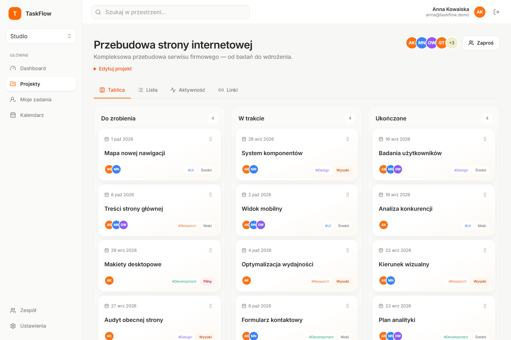
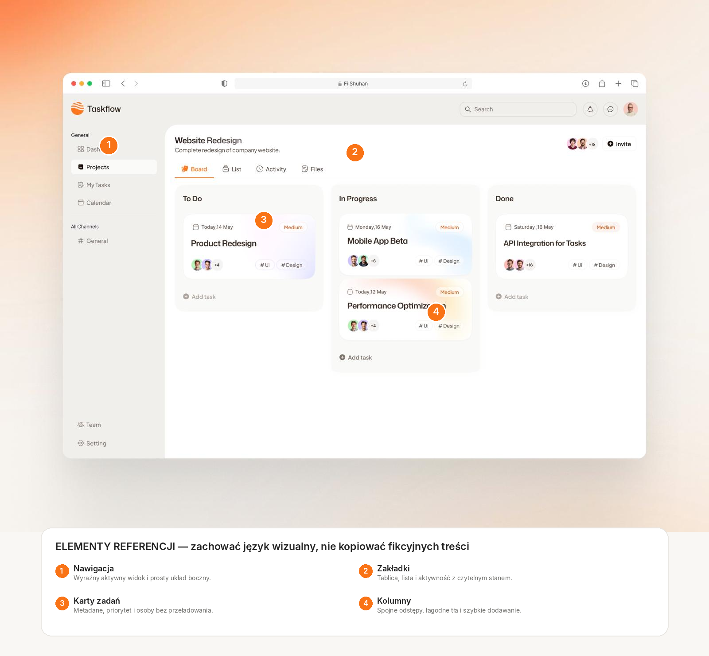
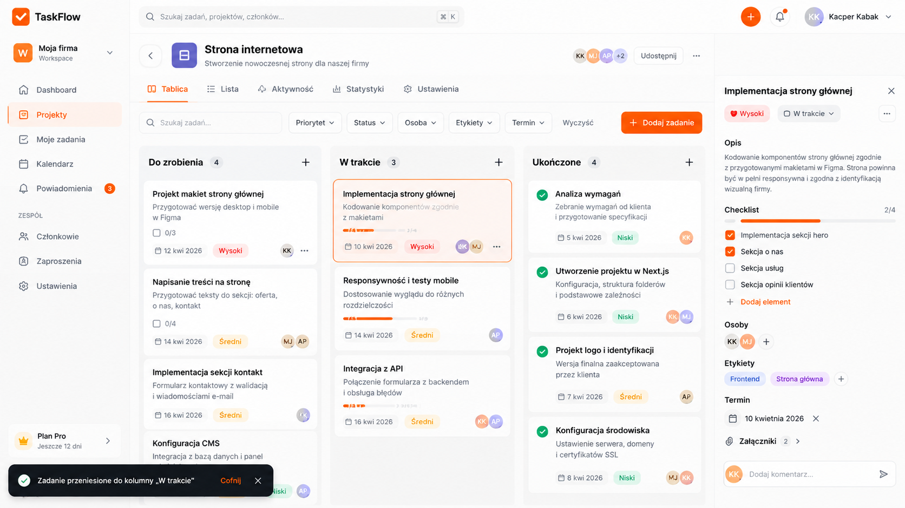
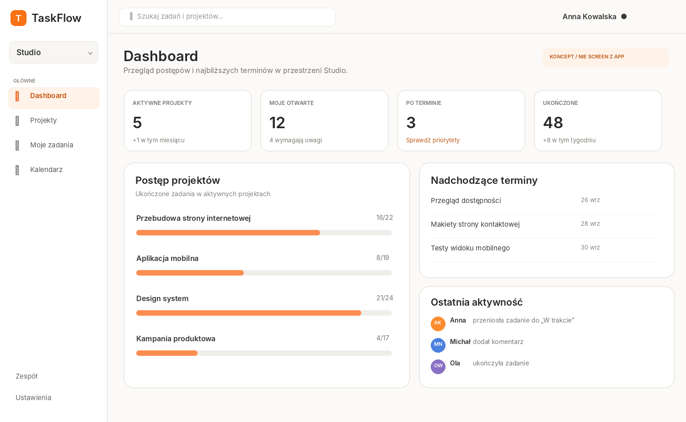
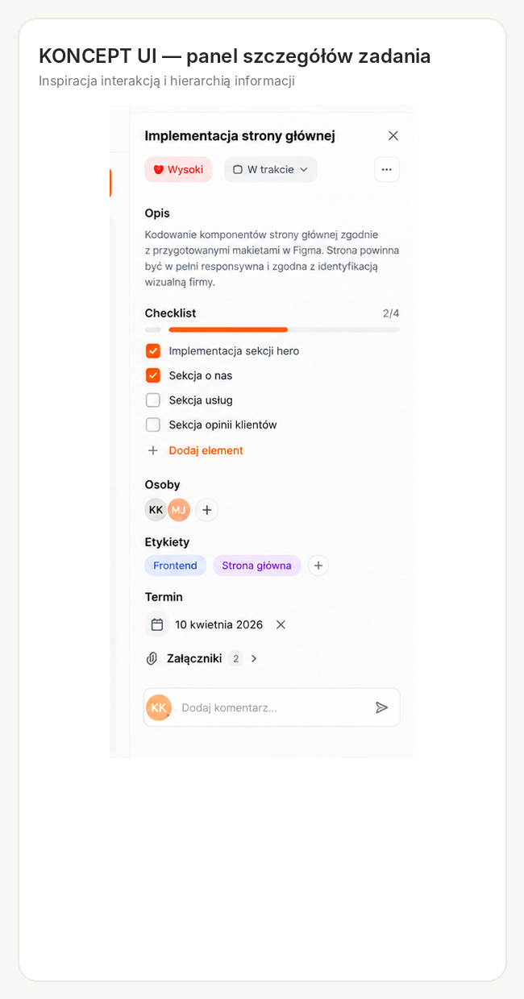
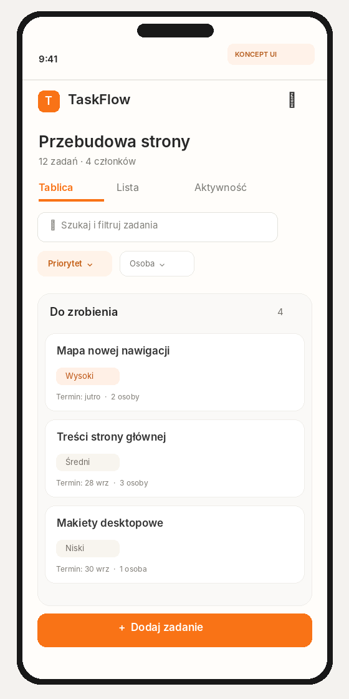
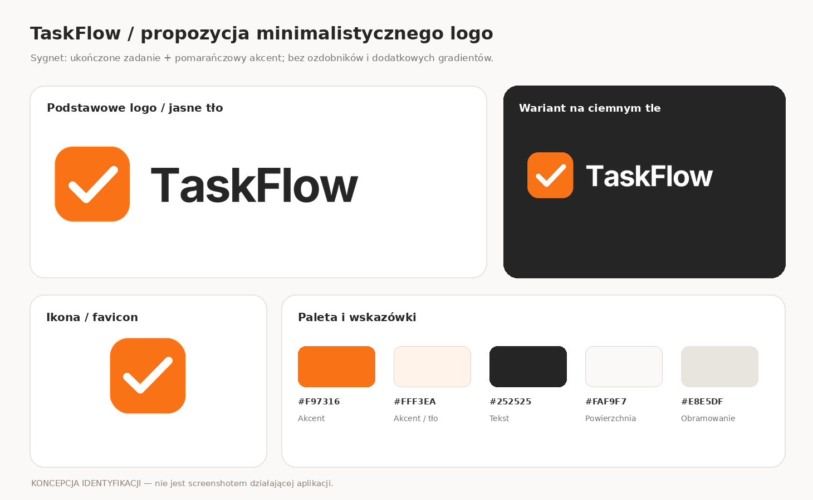

# TaskFlow v1.1 — plan udoskonalenia, UI/UX i wdrożenia

**Dokument wykonawczy dla agenta AI pracującego w VS Code — rewizja 2 (kontrolowane etapy i commity)**
**Repozytorium:** https://github.com/K-Kabak/taskflow
**Punkt odniesienia audytu:** `f9cbdda4bcd1ee8d95d4199c6ff9082eb3224a81` (przed rozpoczęciem sprawdź bieżący `HEAD` — repozytorium mogło się zmienić).
**Specyfikacja bazowa:** `TASKFLOW_AGENT_SPEC.md` (wersja 1.1); niniejszy dokument jest **planem kolejnego wydania**, nie zamiennikiem specyfikacji MVP.
**Cel:** poprawić niezawodność, użyteczność, wizualną spójność i dostępność istniejącej aplikacji; dodać wyłącznie wybrane funkcje v1.1; uruchomić bezpieczne publiczne demo i przygotować projekt do portfolio.

> **Instrukcja nadrzędna:** pracuj na aktualnym repozytorium, nie generuj aplikacji ponownie. Realizuj etapy **1 → 2 → 3 → 4**, ale **wykonuj tylko JEDEN etap na jedną zgodę użytkownika**. W obrębie etapu pracuj samodzielnie, a każdą ukończoną sensowną jednostkę pracy zapisuj w osobnym commicie i wykonuj `git push` po weryfikacji; **nie wolno odkładać całej implementacji do jednego ogromnego commita**. Po zamknięciu etapu zaktualizuj `ROADMAP_V1_1.md` i `PROGRESS.md`, wykonaj testy, commit dokumentacyjny (gdy są zmiany) i ostatni `git push`, przedstaw raport, a następnie **BEZWZGLĘDNIE ZATRZYMAJ SIĘ**. Następny etap wolno zacząć dopiero po wyraźnym poleceniu użytkownika. Nie przepisuj dotychczasowych trzech commitów i **nie używaj `push --force`, `rebase -i` ani `reset --hard`**. W razie blokady albo zbliżającego się limitu zakończ najbliższy bezpieczny punkt kontrolny i udokumentuj wznowienie zamiast rozpoczynać duże podzadanie.

## Zasada nadrzędna: commity i obowiązkowa pauza po KAŻDYM etapie

Ta sekcja ma pierwszeństwo nad wcześniejszymi ogólnymi instrukcjami pracy autonomicznej w specyfikacji MVP. **Agent nie ma upoważnienia do automatycznego rozpoczęcia etapu 2, 3 ani 4 po ukończeniu poprzedniego.** Polecenie „realizuj plan” oznacza: rozpocznij pierwszy nieukończony etap, wykonaj go do końca, zabezpiecz postępy i zatrzymaj się. Nie interpretuj ciszy użytkownika jako zgody na kolejny etap.

### Obowiązkowy rytm pracy wewnątrz pojedynczego etapu

1. Na starcie zweryfikuj branch, `git status -sb`, `git remote -v`, `git log -n 5`, konfigurację autora i zgodność z `origin/main`. Nie twórz nowego repo i nie ruszaj historii istniejących commitów.
2. Zapisz rozpoczęty etap, listę podzadań i punkt wznowienia w `PROGRESS.md` (wzór w `PROGRESS_TEMPLATE.md`). Przygotuj małe porcje pracy: osobny bugfix, refaktoryzacja, komponent, funkcja, migracja/test/dokumentacja.
3. **Po każdej skończonej, spójnej jednostce**: uruchom adekwatne kontrole, sprawdź `git diff` i `git diff --cached`, dodaj do stagingu wyłącznie powiązane pliki/hunki, sprawdź sekrety i przypadkowe pliki, wykonaj prawdziwy logiczny commit oraz `git push`. Nie zbieraj zmian z całego etapu do pojedynczego `feat: implement everything`. Jeśli podzadanie jest duże, podziel je na kolejne małe, poprawne commity. Nie twórz sztucznych/pustych commitów.
4. Trackuj wszystkie **istotne pliki projektu** objęte zmianą: kod, testy, migracje, konfigurację, dokumentację oraz **rzeczywiste** screenshoty. Nie commituj `.env`, sekretów, tokenów, lokalnych danych, `node_modules`, `.next`, wyników builda ani innych plików ignorowanych. „Commituj wszystko” nie oznacza bezmyślnego `git add .`; weryfikuj staging, np. przez dodawanie konkretnych ścieżek / `git add -p`.
5. Po ukończeniu etapu uruchom pełne kontrole wymagane dla tego etapu (w miarę dostępności środowiska), uzupełnij `ROADMAP_V1_1.md` i `PROGRESS.md` o faktyczne wyniki, listę SHA/URL commitów i ewentualne blokady. Zapisz i wypchnij również dokumentację postępu. Sprawdź `git status -sb`, `git log --oneline -n 10`, zgodność `HEAD` z `origin/main` i wynik CI. Nie zgłaszaj zielonego CI bez potwierdzenia.
6. **STOP – bramka akceptacyjna:** poinformuj użytkownika, co zrobiono, jakie testy uruchomiono i z jakim wynikiem, jakie commity/pushe powstały, co pozostało, czy drzewo robocze jest czyste i jak wznowić. **Nie rozpoczynaj kolejnego etapu, nie przygotowuj jego migracji, kodu ani zależności**, dopóki użytkownik nie napisze np. „Rozpocznij etap 2”. Możesz jedynie odpowiedzieć na pytania lub nanieść zlecone poprawki do właśnie zakończonego etapu.

### Limit usage i awaryjny checkpoint

- Nie da się zagwarantować, że limit nigdy nie skończy się w środku etapu. Zmniejsz to ryzyko, pracując małymi podzadaniami, commitując i pushując **w trakcie etapu**, a nie tylko na jego końcu.
- Jeśli użytkownik zgłosi niski limit lub agent rozpozna ryzyko przerwania sesji, **nie zaczynaj nowego dużego podzadania**. Dokończ bieżącą małą, bezpieczną jednostkę, zweryfikuj ją, zrób commit/push (jeżeli możliwe), zapisz w `PROGRESS.md`: ostatni SHA, wykonane i niewykonane rzeczy, testy, zmienione pliki, blokady, precyzyjne następne polecenie. Zatrzymaj się i poczekaj na polecenie kontynuacji **tego samego etapu**.
- Jeżeli przerwanie nastąpi przed domknięciem jednostki, zachowaj pliki, nie wykonuj destrukcyjnego resetu ani commita z niezweryfikowanym kodem. Zapisz aktualny stan i wyraźnie oznacz go jako *w toku*, a nie ukończony. Nie obiecuj pomyślnego pushu, którego nie potwierdzono.
- Nowa sesja najpierw czyta specyfikację, `ROADMAP_V1_1.md`, `PROGRESS.md` i Git, sprawdza faktyczny kod/testy, a następnie **wznawia wyłącznie aktualnie autoryzowany etap**.

**Bramki:** `Etap 1 → STOP → zgoda użytkownika → Etap 2 → STOP → zgoda → Etap 3 → STOP → zgoda → Etap 4 → STOP`. W etapie 4 osobna zgoda może być potrzebna na wybór hostingu, wydatki, podmianę brandingu i publikację wydania — nie utożsamiaj zgody na rozpoczęcie etapu z zgodą na płatności.

## 0. Jak korzystać z tego pakietu i obrazów

Rozpakuj `TASKFLOW_V1_1_PACKAGE.zip` **do katalogu głównego istniejącego repozytorium TaskFlow**, zachowując katalog `docs/taskflow-v11/`. Przekaż agentowi ten plik i poleć otworzyć wszystkie obrazy. Występują trzy rodzaje materiałów — **nie mieszaj ich**:

1. **Istniejący, rzeczywisty screen aplikacji** (jest już w repo):

   

   Jeśli obraz nie wyświetla się poza repozytorium: [otwórz screenshot na GitHubie](https://github.com/K-Kabak/taskflow/blob/main/docs/screenshots/taskflow-board.png). To stan wyjściowy, nie stan po zmianach. Widać lewy sidebar, nagłówek projektu, trzy kolumny Kanban, karty z metadanymi i pomarańczowe akcenty.

2. **Oryginalna inspiracja przekazana przez użytkownika** (załączona lokalnie):

   

   **Adnotacje do inspiracji:**

   

   Zachowaj charakter: jasne ciepłe tło, duże białe przestrzenie, miękkie zaokrąglenia, subtelne granice, dyskretne cienie, pomarańczowy akcent, lekka typografia. **Nie kopiuj fikcyjnych etykiet, liczników, dat, kanałów i przycisków** z inspiracji.

3. **Koncepcje v1.1 — ilustracje docelowego układu, a nie screeny działającego produktu**. Ich liczby, nazwy i część drobnych tekstów są poglądowe; UI należy zbudować na prawdziwych danych i poprawnej polszczyźnie. Nie implementuj elementów spoza zakresu tylko dlatego, że widnieją na obrazie (np. płatny plan, upload plików, przyciski bez działania).

   **Tablica + panel + obszar filtrowania (koncepcja):**

   

   **Dashboard (koncepcja):**

   

   **Panel zadania (kadr koncepcji):**

   

   **Widok mobilny (koncepcja):**

   

**Historyczna propozycja minimalistycznego logo (w pakiecie):**

Źródła historyczne: [`taskflow-mark.svg`](docs/taskflow-v11/branding/taskflow-mark.svg), [`taskflow-wordmark-dark.svg`](docs/taskflow-v11/branding/taskflow-wordmark-dark.svg), [`taskflow-wordmark-light.svg`](docs/taskflow-v11/branding/taskflow-wordmark-light.svg), [`favicon.svg`](docs/taskflow-v11/branding/favicon.svg). Szczegóły w [`README-BRANDING.md`](docs/taskflow-v11/branding/README-BRANDING.md). **Obowiązujące logo zostało zatwierdzone przez użytkownika i znajduje się w `public/branding/taskflow-v1.1/`.** Warianty SVG/PNG przygotowano jako zasoby projektu, nie jako obrazy udające zrzuty ekranu.

**Ważne rozróżnienie zakresu:** w **etapie 2** dopracuj wygląd i interakcje **już działających funkcji**. Nowe checklisty, centrum powiadomień, filtry tablicy i statystyki to **etap 3**. Nie pokazuj nieaktywnych przycisków ani wymyślonych wyników „na pokaz”.

## Zasady wspólne i stan początkowy

- Przed zmianami wykonaj `git status -sb`, `git log --oneline -n 10`, `git remote -v`, sprawdź konto `gh auth status` oraz lokalną tożsamość `git config user.name` i `git config user.email`. Nie zmieniaj tożsamości globalnie, nie zgaduj danych użytkownika.
- Zweryfikuj wynik aktualnego GitHub Actions, uruchom lokalnie `pnpm install --frozen-lockfile`, `pnpm prisma generate`, `pnpm lint`, `pnpm typecheck`, `pnpm test`, `pnpm build` i — po przygotowaniu lokalnej bazy — `pnpm exec playwright test`. Zapisz rzeczywiste wyniki. **Nie przyjmuj automatycznie wyników z poprzedniego raportu za aktualne.**
- Przed zmianą modeli Prisma utwórz migrację; nie usuwaj istniejących danych, nie uruchamiaj `prisma migrate reset` na danych użytkownika. Zadbaj o bezpieczne wdrożenie schematu na środowiskach docelowych.
- Każdy odczyt i zapis jest ograniczony do poprawnie autoryzowanej przestrzeni roboczej po stronie serwera. Nie zaufaj samemu `workspaceId`/`taskId` z URL lub formularza.
- Trzymaj się istniejącego stosu (Next.js, TypeScript, Prisma/PostgreSQL, Auth.js, Tailwind, dnd-kit, Vitest, Playwright). Nie dodawaj mikroserwisów, nowego frameworka ani zależności bez konkretnej potrzeby.
- Przy trudnej poprawce najpierw dodaj test reprodukujący problem, potem popraw kod i sprawdź regresję. Nie raportuj błędu jako potwierdzonego bez reprodukcji; niżej wskazano **miejsca do weryfikacji** na podstawie wstępnego przeglądu repozytorium.
- Komponenty i teksty interfejsu pozostają po polsku. Dostępność: semantyka, klawiatura, widoczny fokus, odpowiedni kontrast, etykiety kontrolek, statusy błędów w `aria-live`/`role="alert"` tam, gdzie stosowne.
- Każdy etap kończy się wynikiem testów, screenshotami **rzeczywiście uruchomionej aplikacji**, aktualizacją postępów, kilkoma logicznymi commitami powstającymi podczas etapu (odpowiednio do rzeczywistych zmian) i zweryfikowanym `git push`. Jeżeli push jest niemożliwy, zachowaj commity lokalnie i opisz blokadę. **Po raporcie etapu obowiązuje STOP i oczekiwanie na wyraźną zgodę użytkownika na następny etap.**

---

# ETAP 1 — Code review i rzeczywiste poprawki

**Status: ukończony 2026-09-25.** Wyniki, dowody i punkt wznowienia: `PROGRESS.md` oraz `docs/quality/REVIEW_V1_1.md`. Punkt dotyczący filtrowanej tablicy należy do Etapu 3 i pozostaje odłożony. Wymagana jest odrębna zgoda użytkownika na Etap 2.

**Cel:** zapewnić poprawność istniejącego MVP, zanim zaczniemy kosmetykę i nowe funkcje. **Nie rozbudowuj zakresu produktu w tym etapie.**

### 1.1 Audyt stanu i lista usterek

- [x] Przejrzyj repo, modele Prisma, Server Actions, uprawnienia, testy, stan CI, konsolę przeglądarki oraz logi serwera.
- [x] Utwórz `docs/quality/REVIEW_V1_1.md`: dla każdej usterki podaj wagę, kroki reprodukcji, oczekiwane/rzeczywiste zachowanie, lokalizację i test regresyjny. Oddziel potwierdzone błędy od usprawnień.
- [x] Sprawdź działanie rejestracji, logowania, tworzenia projektu, CRUD zadań, przesuwania kart, zaproszeń, ról, archiwizacji, listy, kalendarza i wyszukiwania na świeżej bazie.

### 1.2 Kanban i spójność danych

Pliki do przeglądu: `src/components/tasks/kanban-board.tsx`, `src/app/actions/domain.ts`, `src/app/w/[workspaceId]/projects/[projectId]/page.tsx`.

- [x] Zweryfikuj aktualizowanie lokalnego stanu kart po zmianach serwerowych. Obecny komponent inicjuje stan przez `useState(initialTasks)`, a klucz zewnętrzny opiera się na identyfikatorach i statusach; sprawdź scenariusze zmiany **tytułu, terminu, etykiet, przypisań i samej kolejności** bez zmiany statusu.
- [x] Zapewnij przewidywalny stan po zapisie, błędzie, odświeżeniu, szybkich kolejnych gestach i zmianie widoku; nie dopuść do wyświetlania przestarzałych danych.
- [x] Sprawdź równoczesne przenoszenie kart. Zastosuj bezpieczną transakcję i adekwatną obsługę konfliktów/ponowienia operacji; nie zgub kolejności i nie nadpisuj zmian bez komunikatu.
- [x] Dla filtrowanej tablicy w późniejszym etapie 3 nie pozwól, by przeniesienie karty przypadkowo przestawiało ukryte zadania.
- [x] Rozszerz E2E o przeładowanie po DnD, odwrócenie zmiany po niepowodzeniu, sortowanie w obrębie kolumny i edycję danych karty.

### 1.3 Obsługa formularzy i błędów

- [x] Sprawdź Server Actions, które przy `!parsed.success` kończą się bez odpowiedzi dla użytkownika (m.in. w `src/app/actions/domain.ts`). Zwracaj ustrukturyzowane błędy i pokaż je przy właściwych polach / nad formularzem.
- [x] Dodaj stany `pending`, zapobieganie wielokrotnemu wysyłaniu, komunikat zapisu oraz odpowiednią obsługę niepowodzenia w projektach, zadaniach, komentarzach, etykietach i ustawieniach.
- [x] Nie zatajaj błędów infrastrukturalnych pod komunikatem sukcesu. Błędy walidacji i dostępu muszą mieć poprawne, bezpieczne komunikaty po polsku.

### 1.4 Uprawnienia, bezpieczeństwo, typy

- [x] Przetestuj negatywne przypadki cross-workspace (IDOR), role OWNER/ADMIN/MEMBER, operacje na zarchiwizowanym projekcie, wygasłe/zużyte zaproszenie, niedozwolone przypisania i etykiety z obcej przestrzeni.
- [x] Oceń `src/lib/rate-limit.ts`: ustal, czy środowisko wdrożenia ufa nagłówkom proxy (`x-forwarded-for`/`x-real-ip`), zanim użyjesz ich jako identyfikatora; dodaj testy limitów i współbieżnych żądań.
- [x] Usuń niepotrzebne `any` z widoku projektu i panelu zadania, używając jawnych DTO lub typów wynikających z zapytań Prisma.
- [x] Sprawdź, że kod i logi nie ujawniają tokenów zaproszeń, sekretów ani prywatnych danych innej przestrzeni.

### Kryteria odbioru etapu 1

- [x] Każda potwierdzona usterka ma poprawkę i test regresyjny; otwarte ryzyka są jawnie opisane.
- [x] Wszystkie kontrole `lint`, `typecheck`, `test`, `build` i wymagane E2E przechodzą; brak nowych błędów w konsoli krytycznych ścieżek.
- [x] Zmiany są podzielone na **osobne commity według problemu**, np. `fix: synchronize kanban state after task update`, `fix: show server validation errors`, `test: cover cross-workspace mutations`.

- [x] **Bramka etapu 1:** opublikowano zweryfikowane commity i raport w `PROGRESS.md`, przekazano użytkownikowi wyniki i **zatrzymano agenta**; nie zaczynaj etapu 2 bez odrębnej zgody.

---

# ETAP 2 — Dopracowanie UI/UX zgodnie z referencjami

**Wynik Etapu 2:** 17/17 testów, 43 E2E zaliczone, 5 planowo pominiętych; `lint`, `typecheck`, `build` OK. Zrzuty i porównanie: `docs/screenshots/v1.1/` oraz `docs/quality/UI_REVIEW_V1_1.md`. Zatrzymano pracę przed Etapem 3.

**Cel:** ewolucja obecnego wyglądu z zatwierdzonym przez użytkownika nowym logo w `public/branding/taskflow-v1.1/`. Porównuj [screen obecny](docs/screenshots/taskflow-board.png), [referencję z adnotacjami](docs/taskflow-v11/reference-annotated.png) i [koncepcję tablicy](docs/taskflow-v11/concept-kanban-desktop.png). **Koncepcja jest kierunkiem, nie makietą do ślepego odwzorowania.**

### 2.1 Spójny design system

- [x] Użytkownik zatwierdził nowe autorskie logo w `public/branding/taskflow-v1.1/`; zastąp nim ikonę w sidebarze, favicon i metadanych. Materiały w `docs/taskflow-v11/branding/` pozostają wyłącznie historyczną referencją.

- [x] Zdefiniuj zmienne kolorów/odstępów/promieni i typografię w istniejącym systemie Tailwind/CSS. Zastąp wybrane powtarzające się wartości hex wspólnymi tokenami, nie zmieniając nagle całego UI.
- [x] Utrzymaj ciepłą biel, bardzo jasne szarości, pojedynczy pomarańczowy akcent, delikatne obramowania i cienie oraz spójne zaokrąglenia kart, inputów, paneli i przycisków.
- [x] Ujednolić stany `hover`, `focus-visible`, `disabled`, `loading`, `error`, `success` i warianty priorytetów. Nie używaj samego koloru jako jedynego nośnika informacji.
- [x] Zachowaj czytelność tekstu oraz kontrast, także dla przycisków i mniejszych metadanych.

### 2.2 Tablica i nawigacja — konkrety ze screenów

| Obszar | Stan obecny / materiał | Zmiana docelowa |
| --- | --- | --- |
| Sidebar | Obecny screen + punkt **1** adnotowanej referencji | Wyraźny aktywny element, konsekwentne odstępy, poprawny stan mobilnego drawer; bez atrap pozycji. |
| Zakładki | Punkt **2** referencji | Stabilna wysokość, podkreślenie aktywnego widoku, poprawna nawigacja po klawiaturze. |
| Karty | Punkt **3**, koncepcja tablicy | Jednoznaczny tytuł, termin, priorytet, etykiety i przypisani; czytelny uchwyt DnD; niewielkie, spójne cienie. |
| Kolumny | Punkt **4** referencji | Spójne szerokości/odstępy, responsywny poziomy scroll na telefonie, sensowne puste stany i szybkie dodanie zadania. |
| Komunikaty | Koncepcja tablicy/panelu | Po operacji wyświetl zwięzły toast/status z wynikiem; jeśli realnie wspierasz cofnięcie, akcja „Cofnij” musi działać. |

- [x] Nie umieszczaj nowego paska filtrów z koncepcji jako martwej dekoracji. **Filtry Kanbanu pojawią się dopiero po implementacji w etapie 3**.
- [x] Zachowaj istniejące nazwy i rzeczywiste dane użytkowników; nie wstawiaj na stałe nazw, dat ani liczników z ilustracji.

### 2.3 Panel zadania, formularze i dostępność

Materiał: [kadr panelu zadania](docs/taskflow-v11/concept-task-panel.png).

- [x] Uporządkuj hierarchię panelu: nagłówek i status; tytuł/opis; priorytet, termin i przypisani; etykiety; komentarze; linki; historia. Sekcja checklisty pojawia się **dopiero w etapie 3**.
- [x] Panel `role="dialog"` powinien poprawnie zarządzać fokusem, obsługiwać Escape, utrzymywać fokus wewnątrz i przy zamknięciu przywracać go do wywołującego elementu; sprawdź zamykanie po kliknięciu tła.
- [x] Przycisk zamykania powinien zachowywać bieżący widok/filtry tam, gdzie to stosowne; nie gub kontekstu użytkownika.
- [x] Zapewnij widoczne błędy walidacji, status zapisywania i prawidłowe etykiety pól; nie zostawiaj samych placeholderów jako etykiet.

### 2.4 Dashboard i mobile

Materiały: [dashboard](docs/taskflow-v11/concept-dashboard.png), [mobile](docs/taskflow-v11/concept-mobile.png).

- [x] Popraw proporcje istniejących kafli statystyk, list projektów i terminów; ujednolić odstępy i typografię. **Nowy wykres postępów i feed w dashboardzie dopiero w etapie 3**.
- [x] Na szerokościach 360/390/768/1280/1440 px sprawdź poziomy overflow, menu, nawigację, tablicę, przyciski i panel zadania. Tylko tablica może mieć zamierzony poziomy scroll; formularze i nagłówek nie powinny wyjeżdżać poza viewport.
- [x] Na urządzeniach dotykowych uchwyt DnD nie może uniemożliwiać przewijania; zapewnij alternatywne przenoszenie zadania przez pole statusu.
- [x] Dodaj stany puste/ładowania i sensowne komunikaty błędów; nie wstawiaj danych demonstracyjnych przy braku danych.
- [x] Preferuj subtelne animacje respektujące `prefers-reduced-motion`.

### 2.5 Obowiązkowe rzeczywiste screeny po implementacji

Zapisz do `docs/screenshots/v1.1/` (z anonimowymi/testowymi danymi): `kanban-desktop.png`, `dashboard-desktop.png`, `task-panel.png`, `kanban-mobile.png`, `empty-state.png`. Zrób porównanie z aktualnym screenem; w `docs/quality/UI_REVIEW_V1_1.md` opisz faktyczne zmiany i ewentualne odstępstwa od koncepcji. Nie przedstawiaj obrazów koncepcyjnych jako screenshotów działającej aplikacji.

### Kryteria odbioru etapu 2

- [x] Zachowano oryginalny język wizualny, a wskazane ekrany są spójne i funkcjonalne.
- [x] Brak klikalnych atrap; podstawowe interakcje dostępne z klawiatury i na urządzeniach mobilnych.
- [x] Testy wizualne lub manualny przegląd z zapisanymi screenami przy ww. rozdzielczościach; `lint`, `typecheck`, `test`, `build`, E2E bez regresji.
- [x] Logiczne commity, np. `style: unify dashboard and kanban tokens`, `fix: make task dialog keyboard accessible`, `style: refine mobile navigation`.

- [x] **Bramka etapu 2:** opublikowano zweryfikowane commity i raport w `PROGRESS.md`, przekazano użytkownikowi wyniki i **zatrzymano agenta**; nie zaczynaj etapu 3 bez odrębnej zgody.

---

# ETAP 3 — TaskFlow v1.1: wybrane funkcje

**Status: ukończony 2026-09-26.** Weryfikacja: 25 testów jednostkowych, 57 E2E zaliczonych, 7 planowo pominiętych, lint/typecheck/build OK. Szczegóły w `PROGRESS.md` i `docs/quality/STAGE3_METRICS.md`; zrzuty w `docs/screenshots/v1.1-stage3/`. Etap 4 wymaga osobnej zgody.

**Cel:** dołożyć dokładnie cztery użyteczne funkcje. Ta sekcja jest **jawnym rozszerzeniem** wcześniejszego MVP, nie poleceniem realizacji wszystkich pomysłów z oryginalnego zrzutu. Wciąż poza zakresem: płatności, czat, upload plików, realtime, AI, zewnętrzne integracje, wysyłka e-mail/push i osobna aplikacja mobilna.

### 3.1 Podzadania / checklista w zadaniu

- [x] Dodaj model Prisma `TaskChecklistItem` (lub równoważny): identyfikator, `taskId`, treść, pozycja, znacznik ukończenia, daty; indeks po zadaniu i pozycji. Migracja bez utraty istniejących zadań.
- [x] Dodawanie, edycja, oznaczanie i usuwanie pozycji z walidacją długości/limitu; sprawdzenie uprawnień do zadania i stanu archiwizacji **na serwerze**.
- [x] Postęp `ukończone / wszystkie` w panelu zadania, opcjonalnie dyskretny wskaźnik na karcie. Nie pokazuj `0/0` jako pozornego postępu.
- [x] Testy jednostkowe i E2E tworzenia, przeładowania, braku dostępu i zarchiwizowanego projektu.

### 3.2 Filtrowanie bezpośrednio na tablicy Kanban

- [x] Przenieś użyteczność filtrów znaną z widoku listy na tablicę: tekst, priorytet, przypisana osoba, etykieta, zakres/stan terminu. Zastosuj nazwy filtrów zrozumiałe po polsku.
- [x] Utrzymuj stan w parametrach URL, aby można było odświeżyć i udostępnić widok; oferuj „Wyczyść filtry” i liczbę aktywnych filtrów.
- [x] DnD przy aktywnych filtrach: jawnie wybierz i zaimplementuj bezpieczną regułę — np. zablokuj ręczne przestawianie kolejności z czytelną informacją, pozwalając na zmianę statusu przez edycję. **Nigdy** nie wyliczaj nowej globalnej kolejności wyłącznie z przefiltrowanej listy.
- [x] Puste wyniki powinny komunikować, że to rezultat filtrów, a nie brak zadań w projekcie. Testy URL, filtrów i DnD.

### 3.3 Centrum powiadomień w aplikacji (bez maili i realtime)

- [x] Dodaj rekordy powiadomień dla użytkownika w danej przestrzeni: `userId`, `workspaceId`, typ, opcjonalne powiązanie z zadaniem/projektem, czytelny opis, `createdAt`, `readAt`, opcjonalny klucz zdarzenia zapobiegający duplikatom.
- [x] Zdarzenia: przypisanie do zadania, nowy komentarz w zadaniu przypisanym do użytkownika, opcjonalnie termin zbliżający się w nadchodzących dniach przy kontrolowanym sposobie generowania. Nie wysyłaj powiadomienia do autora własnej czynności.
- [x] Panel dzwonka/strona powiadomień: licznik nieprzeczytanych, lista, przejście do zadania, oznaczenie jako przeczytane. Zwykłe odświeżenie strony jest wystarczające; nie udawaj działania realtime.
- [x] Waliduj odbiorcę i workspace po stronie serwera. Testy izolacji odbiorców i idempotencji powiadomień.

### 3.4 Statystyki projektów i dashboard

- [x] Pokaż wyłącznie metryki wyliczane z bazy w bieżącej przestrzeni: liczba zadań wg statusu, udział ukończonych, zadania po terminie, ostatnia aktywność; ewentualnie trend w ustalonym oknie czasowym na podstawie danych, które faktycznie istnieją.
- [x] Dodaj prosty wykres/paski postępu (bez rozbudowanej biblioteki, jeśli CSS/SVG wystarczy). Udokumentuj definicje metryk: mianownik, daty, czy zarchiwizowane projekty są wyłączone.
- [x] Obsłuż zero danych i małe ekrany; nie twórz fałszywych KPI z koncepcji. Testy agregacji oraz ograniczenia do `workspaceId`.

### Kryteria odbioru etapu 3

- [x] Migracja działa od obecnej bazy; wszystkie nowe operacje mają walidację, autoryzację i sensowne błędy.
- [x] Nowe funkcje działają po odświeżeniu i mają automatyczne testy pozytywne i negatywne.
- [x] Ekrany etapu 2 zostały uzupełnione realnymi funkcjami z etapu 3; screenshoty są ponownie wykonane na aktualnej wersji.
- [x] Osobne logiczne commity, np. `feat: add task checklist`, `feat: filter kanban board`, `feat: add in-app notifications`, `feat: show workspace progress metrics`.

- [x] **Bramka etapu 3:** opublikowano zweryfikowane commity i raport w `PROGRESS.md`, przekazano użytkownikowi wyniki i **zatrzymano agenta**; nie zaczynaj etapu 4 bez odrębnej zgody.

---

# ETAP 4 — Deployment i przygotowanie do portfolio

**Cel:** działające, bezpieczne demo dostępne przez HTTPS, powtarzalny proces wdrożenia i dokumentacja pokazująca zarówno produkt, jak i sposób jego uruchomienia.

### 4.1 Gotowość wdrożeniowa

- [x] Sprawdź zgodność wymagań aktualnego `package.json` (Node/pnpm/Next/Prisma) z hostingiem. Wybrano darmowe Vercel + Neon za zgodą użytkownika; konfiguracja i źródła: `docs/deployment/VERCEL_NEON_V1_1.md`.
- [ ] Ustaw sekrety wyłącznie w ustawieniach hostingu (`DATABASE_URL`, `NEXTAUTH_SECRET`, `NEXTAUTH_URL`, `RATE_LIMIT_SECRET` zgodnie z kodem); użyj prawidłowego adresu HTTPS. Nie kopiuj lokalnych sekretów do repo ani dokumentu.
- [ ] Stosuj `prisma migrate deploy` w przewidywalnym kroku wdrożenia, bez resetu produkcyjnej bazy. Sprawdź adapter PostgreSQL, połączenia i wymagania ewentualnego poolingu w docelowym środowisku.
- [x] Zadbaj o ochronę przed nadużyciami oraz zaufane nagłówki proxy w nowym środowisku. Limity IP z nagłówka Vercel i usuwanie wygasłych wpisów przetestowano lokalnie (`a74a3cc`); rzeczywista kontrola po deploymencie pozostaje w sekcji odbioru.

### 4.2 Demo i konta testowe

- [ ] Publiczne demo działa na osobnej bazie, bez rzeczywistych danych użytkownika. Jeśli dodajesz konto demonstracyjne, odizoluj je od prawdziwych kont, ogranicz destrukcyjne operacje lub zapewnij bezpieczny reset danych demo. **Nie uruchamiaj developerskiego seeda w produkcji** — obecny projekt blokuje seed przy `NODE_ENV=production`.
- [ ] Sprawdź pełny przepływ: otwarcie landing page → rejestracja/logowanie/demo → projekt → zadanie → Kanban → wylogowanie. Nie umieszczaj sekretów ani dostępu administracyjnego w README.
- [ ] Jeśli wdrożenie wymaga logowania, API keys, domeny lub wyboru płatnego planu — zgłoś konkretną blokadę, nie pozoruj sukcesu.

### 4.3 CI, README i prezentacja projektu

- [ ] Utrzymaj zielone GitHub Actions: lint, typy, testy, build, migracje i Playwright. Dodaj smoke test publicznego URL po wdrożeniu (jeśli hosting pozwala).
- [ ] README: zwięzły opis produktu, funkcje, stack, **rzeczywiste** screenshoty v1.1, link demo, instrukcja uruchomienia, migracje, testy, architektura/uprawnienia, ograniczenia i informacje o środowisku demo.
- [ ] Usuń nieaktualne opisy (np. jeśli v1.1 dodała powiadomienia, nie twierdź już, że ich nie ma). Zaktualizuj `TASKFLOW_AGENT_SPEC.md` wyłącznie tam, gdzie trzeba rozróżnić MVP od v1.1; zachowaj historyczną specyfikację jako referencję bazową lub dodaj jasną sekcję zmian.
- [ ] Przygotuj GitHub Release/tag `v1.1.0` **dopiero po** potwierdzeniu wdrożenia, testów i akceptacji przez użytkownika; nie nadpisuj starych tagów.
- [ ] W podsumowaniu podaj rzeczywisty URL demo, SHA końcowego commita, wyniki workflow, zakres wdrożenia i ewentualne otwarte ograniczenia.

### Kryteria odbioru etapu 4

- [ ] Publiczny URL otwiera działającą aplikację przez HTTPS; przeprowadzono smoke test po wdrożeniu.
- [ ] Sekrety i baza demo są odizolowane; migracje wykonano bez utraty danych; GitHub Actions zielone.
- [ ] README ma aktualne screeny i link do demo; `ROADMAP_V1_1.md` dokumentuje faktyczny stan, a nie deklarację bez weryfikacji.
- [ ] Commity rozdzielają konfigurację wdrożenia, dokumentację i ewentualne poprawki; ostatni `git push` zakończony pomyślnie.

- [ ] **Bramka etapu 4:** opublikowano zweryfikowane commity i raport w `PROGRESS.md`, przekazano użytkownikowi wyniki i **zatrzymano agenta**; nie zaczynaj etapu kolejnego wydania bez odrębnej zgody.

---

## Harmonogram wykonawczy i zasady commitów

| Kolejność | Punkt kontrolny | Przykład commita | Co pokazać użytkownikowi po zakończeniu |
| --- | --- | --- | --- |
| 1 | Usterki potwierdzone i naprawione | `fix: handle validation errors in task forms` | Wykaz poprawek, testy regresyjne, status CI |
| 2 | Spójny interfejs i dostępność | `style: refine task board and mobile layout` | Rzeczywiste screeny porównawcze i testy UI |
| 3 | Funkcje v1.1 działają | Osobny `feat:` dla checklist, filtrów, powiadomień i statystyk | Scenariusze E2E, migracja, aktualne screenshoty |
| 4 | Demo i dokumentacja gotowe | `docs: prepare TaskFlow v1.1 portfolio release` | Link HTTPS, zielone CI, README i raport końcowy |

**Reguły:** commituj i pushuj **po każdej zakończonej logicznej zmianie wewnątrz etapu**, a nie „wszystko na koniec”. Dla etapu 3 każda z czterech funkcji powinna mieć co najmniej własny realny commit funkcjonalny (i odpowiednie testy/migracje); inne etapy dziel według niezależnych poprawek i dokumentacji, bez wymuszania pustych commitów. Commity opisuj zgodnie z zawartością; staging kontroluj przed commitem. Nie publikuj niezweryfikowanego/uszkodzonego kodu jako gotowego. Sprawdzaj `git diff --cached`, `git status -sb`, `git log -n 10` i synchronizację z `origin/main`. W razie limitu sesji zostaw `PROGRESS.md` z dokładnym punktem wznowienia. Nie przepisuj obecnej historii dla samej liczby commitów. **Po KAŻDYM etapie wykonaj końcowy checkpoint, raport i STOP; następny etap dopiero po nowej komendzie użytkownika.**

## Definition of Done całej wersji v1.1

- [x] Etap 1: naprawione potwierdzone problemy, rzetelny raport i testy regresyjne.
- [x] Etap 2: spójne, dostępne UI na desktopie i telefonie; nowe rzeczywiste screenshoty.
- [x] Etap 3: checklisty, filtry Kanbanu, powiadomienia w aplikacji, statystyki — z migracjami i testami.
- [ ] Etap 4: działające bezpieczne demo HTTPS, aktualne README i zielone CI.
- [ ] Brak sekretów w repo, brak atrap funkcjonalności, brak utraty danych z dotychczasowego MVP.
- [ ] W repo widać osobne logiczne commity dla faktycznych zmian v1.1 oraz aktualny stan `ROADMAP_V1_1.md`/`PROGRESS.md`.

**Nie kończ ETAPU po napisaniu kodu:** wykonaj jego weryfikację, dokumentację i synchronizację z GitHubem. **Następnie obowiązkowo zatrzymaj się po etapie i czekaj na osobną zgodę użytkownika.** W środku etapu wolno przerwać także przy rzeczywistej blokadzie, sygnale o niskim usage lub po bezpiecznym checkpointcie, dokumentując dokładny punkt wznowienia.
